# HEMY Blender BIM add-ons

Source and installable packages for the **11 custom add-ons** in the [BIM UX feature map](docs/BIM_UX_FEATURES.md). The twelfth add-on in that setup, official **Bonsai 0.8.5**, is an external dependency. The documented environment is Blender **5.2.1 LTS**.

## What each add-on does

| Add-on | Version | How you use it |
| --- | --- | --- |
| `hemy_ifc_panel` | 0.4.2 | Inspect an element's IFC properties, filter model visibility by IFC class, or use **BIM → Active Tool → Create Wall from Photo** to build a layered wall type. See the [photo-wall guide](docs/Hemy_IFC_User_Guide.md). |
| `bonsai_ux_host` | 0.2.0 | Open the **BIM** tab in the 3D View sidebar. Choose a task, then use **Context**, **Active Tool**, **Selection**, **View**, or **Collaboration**. It also places storey, workplane, Plan/3D, and Nucleus status controls in the viewport header. |
| `bonsai_storey_toolbar` | 1.2.0 | Choose an IFC storey, switch between locked **Plan** and navigable **3D**, and set a vertical **View Range**. The selected storey becomes Bonsai's default spatial container. |
| `workplane_toolkit` | 1.0.0 | Set a modeling plane from a selected face, the cursor, the current view, or an XY/XZ/YZ world plane. Use its grid and transform orientation while modeling, then restore the previous setup. |
| `bonsai_grid_toolbar` | 1.1.0 | Open **IFC Grid** in the left toolbar or sidebar. Create a row/column grid, draw or offset axes, rename labels, and stretch a straight axis by dragging an endpoint handle. |
| `bonsai_plan_dimensions` | 0.1.1 | In **Plan Dimensions**, select a storey and two parallel walls or grid axes. Add a dimension, then edit its value to move the chosen wall or grid axis in the IFC model. It can also chain selected grid axes. |
| `bonsai_dynamic_dimension` | 0.3.2 | In top plan, pick two parallel IFC wall faces or two IFC points and place an aligned reference dimension. **Edit Value** can move the linked IFC element when you choose to make a driving edit. |
| `bonsai_section_box` | 1.1.0 | Select model elements and choose **BIM → View → Fit Section Box to Selection** to focus on a 3D region. Use **Reset Section Box** to restore the view. |
| `bonsai_slab_thickness` | 1.3.0 | With a typed wall, slab, or column selected, use **BIM → Selection** or the corresponding Bonsai tool to set type-specific wall/slab thickness or rectangular/circular column profile size. Existing occurrences of that type are regenerated. |
| `bonsai_nucleus_files` | 1.0.0 | Open **BIM → Collaboration** or **File → BIM Projects on Nucleus** to browse projects. Use the native browser's distinct **Open**, **Save**, and **Save As** actions for IFC/IFCZIP or Blender files. |
| `bonsai_nucleus_sync` | 0.1.0 | Configure a Nucleus USD stage and receiver token, then start, stop, or resync a live session from **BIM → Collaboration** or the **Bonsai Sync** sidebar. |

### Illustrated interface


*Illustration of the control layout; it is not a screenshot of a project. The BIM tab collects shortcuts while the companion add-ons perform the actions.*

For a typical plan task: **open an IFC in Bonsai → select a storey → choose Plan → create or edit a grid → place a dimension → save the IFC through Bonsai**. A `.blend` save alone does not save IFC edits. For review, select elements and use **View → Fit Section Box to Selection**; use **Collaboration** only after configuring your own Nucleus service.

The source directories hold the custom add-ons captured with the handover. Machine-specific Nucleus server defaults and SDK paths were removed from this repository copy. The two Blender extensions, `bonsai_plan_dimensions` and `workplane_toolkit`, have `blender_manifest.toml` files and their ZIPs use the extension layout. The other nine ZIPs use the legacy add-on folder layout. Keep each add-on's own license files with its source and ZIP.

## Build and install

Install and enable official Bonsai first. Save your work and close other Blender windows, since the installer updates add-on files and Blender preferences. From the repository root, build the packages and run the bulk installer with Blender 5.2:

```powershell
python scripts/package.py
$blender = 'C:\Program Files\Blender Foundation\Blender 5.2\blender.exe'
& $blender --background --python-exit-code 1 --python scripts/install_all.py
```

`scripts/package.py` creates **one ZIP per add-on** in `dist/`. `scripts/install_all.py` validates all 11 ZIPs before changing Blender, installs both extension and legacy formats, enables the companion add-ons before `bonsai_ux_host`, and saves Blender preferences. It updates existing copies of these add-ons. It does not install official Bonsai, open an IFC model, or configure Nucleus access.

GitHub Actions builds and checks the same 11 ZIPs on every push and pull request. If you download the `blender-addons` artifact from a successful run, **extract the artifact ZIP first** and point the installer at the folder containing the 11 individual ZIPs:

```powershell
& $blender --background --python-exit-code 1 --python scripts/install_all.py -- --source 'C:\path\to\extracted\blender-addons'
```

Run `--dry-run` after the final `--` to check the ZIPs and prerequisites without installing. Use `--install-only` to place the packages before Bonsai is enabled; you must then enable Bonsai and these add-ons in Blender Preferences. The `blender-addons` artifact is a build output, not a published GitHub Release. You can still install individual ZIPs through **Edit → Preferences → Get Extensions → Install from Disk**. The UX Host exposes controls from enabled companion add-ons; its buttons do not replace their implementations. Nucleus file access and live sync additionally need your own Nucleus service and connection settings.

The BIM sidebar groups controls under **Context, Active Tool, Selection, View, Collaboration**. Its task switcher offers **Select, Create, Grid, Dimension, Workplane, Section, Inspect**. The viewport header exposes the storey, workplane, plan/3D, and Nucleus status controls. The handover lists the exact UI locations and the actions that were tested.

## Add-on usage guide

These workflows follow the supplied *Blender and Bonsai Illustrated Addon Guide* for the installed versions listed above. The diagrams are instructional illustrations, not screenshots. Open an IFC in Bonsai before using tools that edit IFC elements. With the pointer over the 3D Viewport, press **N** for the sidebar or **T** for the left toolbar. Work in Object Mode unless a step says otherwise.

### Bonsai 0.8.5 — IFC foundation

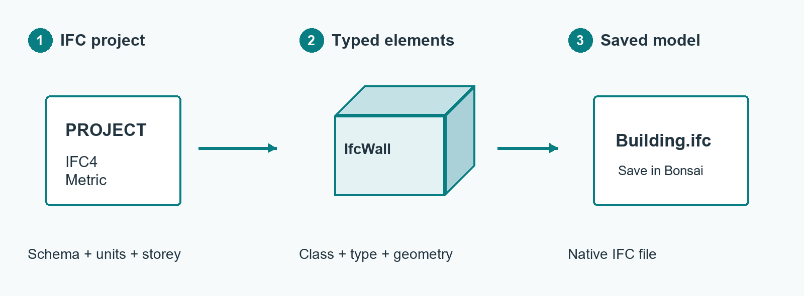

1. Open an IFC project in Bonsai or create one from **Project Overview** with the intended schema and units.
2. Choose a storey, select a Wall, Slab, or Column tool and an IFC type, then place the element.
3. Check the element's IFC class, type, and spatial container. **Save the IFC through Bonsai**; save `.blend` separately for Blender scene settings.

A Blender mesh by itself is not an IFC product. Bonsai is installed separately and is not one of the 11 custom packages in this repository.

### Workplane Toolkit 1.0.0 — model on a chosen plane

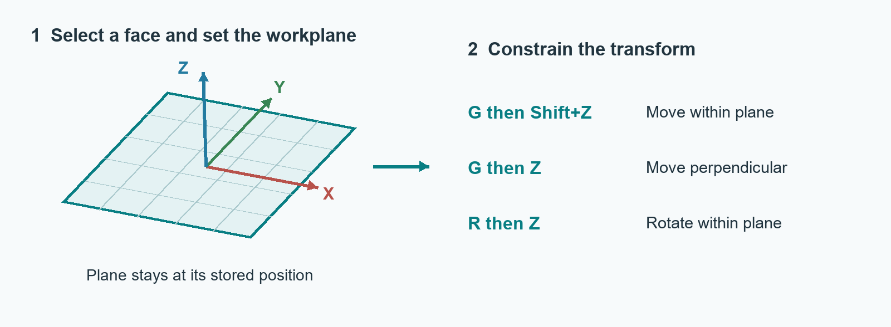

1. In **N → Workplane**, choose **From Selected Face** in mesh Edit Mode, or use **3D Cursor**, **Current View**, or XY/XZ/YZ.
2. Use **Look at Workplane** to face it. With Cursor transform orientation, use **G, Shift+Z** to move within the plane, **G, Z** to move normal to it, and **R, Z** to rotate within it.
3. Click **Apply** after changing Origin or Rotation. Use **Restore Previous Setup** when finished.

The workplane grid is a visual aid; its spacing does not turn on snapping. Setting a workplane does not move existing geometry.

### Bonsai Dynamic Dimension 0.3.2 — reference measurement

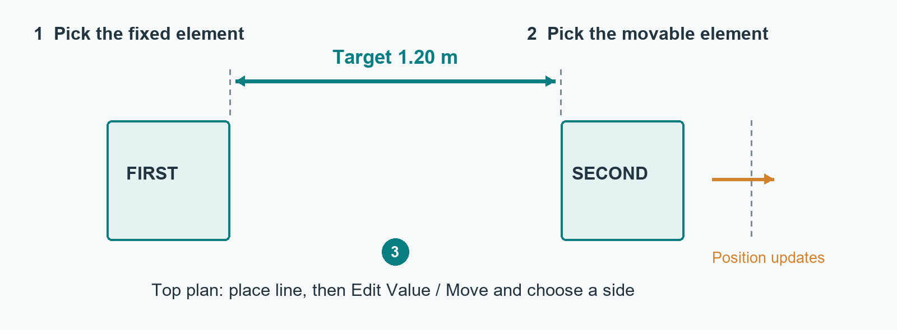

1. Open an IFC project in **top orthographic plan**. Choose **Aligned Dimension** in the Bonsai sidebar or the Dynamic Dimension toolbar tool.
2. Pick two parallel wall envelope faces or two IFC points, then click away from the elements to place the dimension line.
3. To change placement, select a referenced element and use **Edit Value / Move** in the original panel. Enter the new distance and confirm which element will move.

Placing a reference dimension alone does not move geometry. An explicit edit can move IFC placement; save the IFC for that change and `.blend` for the dimension records. The dimension does not impose a permanent constraint.

### Bonsai Driving Plan Dimensions 0.1.1 — IFC-stored spacing

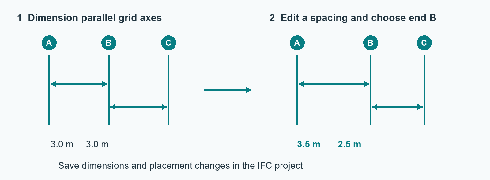

1. In **N → Plan Dimensions**, choose a Building storey and enter top plan. Select two parallel IFC walls; select the intended movable wall last to make it **End B**. For grids, select individual straight `IfcGridAxis` objects.
2. Choose **Clear faces** or **Body centres**, set the line offset, and click **Dimension 2 Selected**. Use **Chain Selected Grids** for three or more parallel axes.
3. Edit the displayed value, choose **End A** or **End B**, confirm, inspect neighboring geometry and dimensions, then save the IFC through Bonsai.

Definitions are stored in the IFC and reappear when it is reopened. Moving one grid axis can change adjacent measured gaps; a chain does not lock all spacings. The labels are viewport overlays, not rendered drawing annotations.

### Bonsai IFC Grid Toolbar 1.1.0 — lay out grid axes

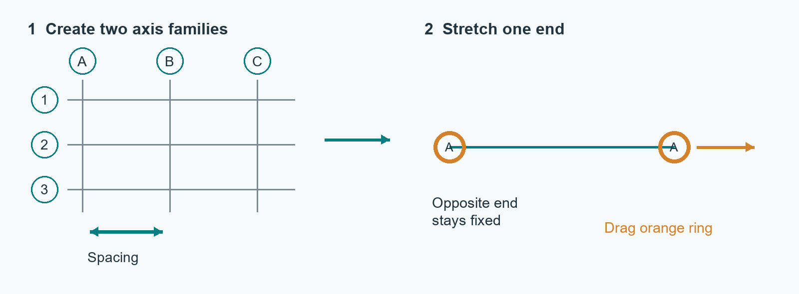

1. With an IFC project and default spatial container open, choose **IFC Grid → New Grid** in the left toolbar or **N → IFC Grid**. Set row and column counts and spacing, then click **Create Grid**.
2. Use **More settings** for unequal gaps, labels, rotation, or elevation. Use **Draw Line**, **Offset Axis**, or **Rename Axis** to refine the layout.
3. Select a straight axis and drag its orange endpoint ring to change only one end. Save the IFC after editing.

Turn on **Show Gizmos** and **Show Overlays** to see handles. A new grid needs both axis families; curved axes cannot be stretched with this handle.

### Bonsai Nucleus Files 1.0.0 — open and save native projects

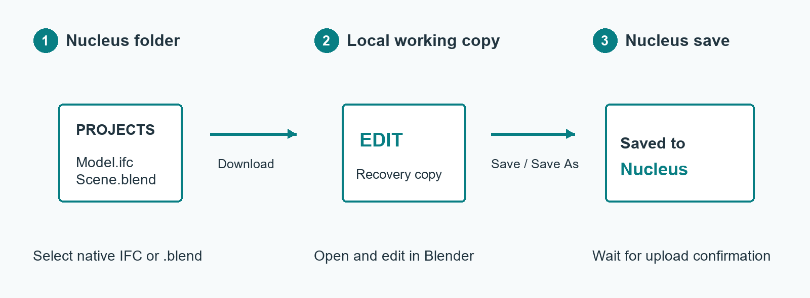

1. In add-on preferences, enter your Nucleus home folder and configure the NVIDIA SDK Python and SDK folder. You can set `BONSAI_NUCLEUS_PYTHON` and `BONSAI_NUCLEUS_SDK`, then use **Detect Runtime**. In **N → Nucleus**, choose **Connect / Refresh** and complete browser sign-in if prompted.
2. Browse to an IFC, IFCZIP, or `.blend` project and use **Open from Nucleus**. Save current work before confirming a project switch.
3. Choose **IFC project** or **Blender project**, then **Save As** for a new remote file or **Save** for the associated one. Wait for **Saved to Nucleus**; retain the local copy if a transfer fails.

The repository copy has no preconfigured server or SDK path. Ordinary **Ctrl+S** saves locally; it does not upload to Nucleus. A remote `.blend` save does not also update a separate remote IFC file.

### Bonsai Nucleus Live Sync 0.1.0 — outgoing review session

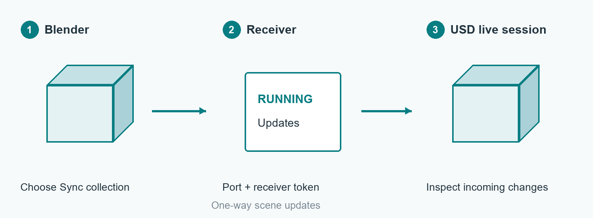

1. Start your configured Nucleus receiver and prepare the intended USD stage and live session.
2. In **N → Bonsai Sync**, enter the stage, receiver port and token, and optionally choose a Sync collection. Click **Start Live Sync** and verify a small edit reaches the receiving scene.
3. Use **Resync All** if necessary and **Stop Sync** when finished. Save the IFC or `.blend` separately.

Enabling the add-on does not start a connection. Sync sends supported scene data outward for review; it is not two-way IFC authoring or a native project save.

### Bonsai 3D Section Box 1.1.0 — inspect a region

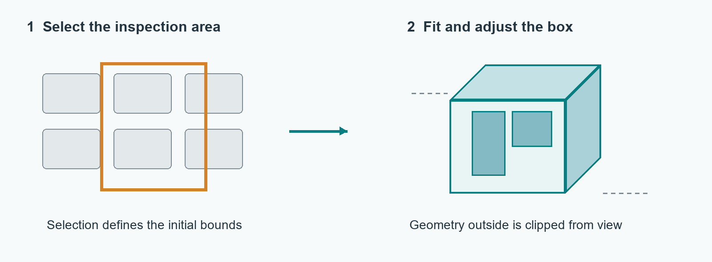

1. In Object Mode, select the elements that define the area. Clear other clipping planes if they are active.
2. Use **BIM → View → Fit Section Box to Selection**, the Section panel, or **Alt+Shift+B**. Adjust Center, Size or Padding in **N → Section**.
3. Use **Frame Section Box** to refocus, then **Clear Section Box** to restore the previous view and clipping setup.

The box affects viewport display only; it does not cut or delete IFC geometry. Storey View Range pauses while the box is active.

### Bonsai Slab Wall and Column Sizes 1.3.0 — edit type dimensions

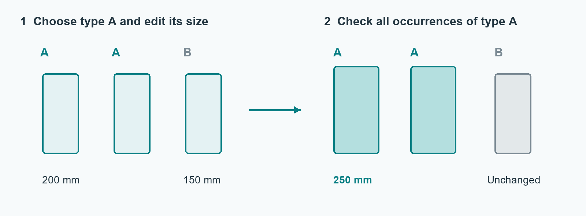

1. Choose the Bonsai Slab, Wall or Column tool and confirm the selected **IFC type**.
2. Set **Thickness** for a single-layer slab or wall type. For a rectangular column profile, set width and depth; for a circular one, set diameter.
3. Inspect all occurrences of that type and save the IFC. Assign a separate type first if only one element should differ.

Use Bonsai's Material Layers editor for multilayer wall or slab assemblies and its profile editor for other profile shapes. Type edits can regenerate multiple elements.

### Bonsai Storey Toolbar 1.2.0 — work by floor

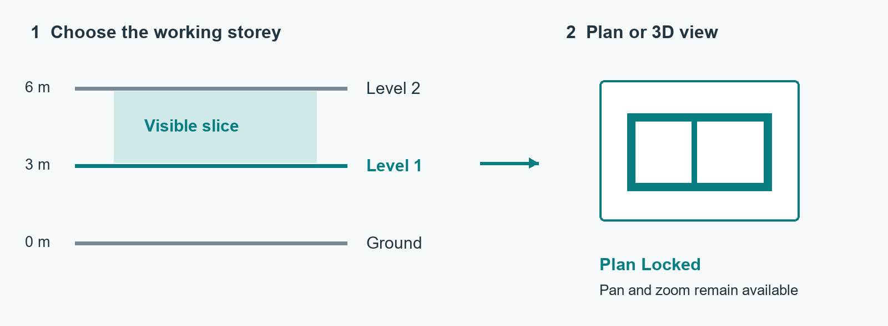

1. In the viewport tool header or **N → IFC Storeys**, choose **Select Storey**. The selected floor becomes the default spatial container and workplane.
2. Work in **Plan Locked** to pan, zoom and edit without orbiting. Enable **View Range** for a level-to-level slice or set custom elevations.
3. Click **3D View** to orbit the same slice, then **Plan Locked** to return. Save `.blend` to retain view-range settings.

At the top storey, **Height** supplies the upper range limit. View Range pauses in Edit Mode or when Section Box or other clipping planes are active; it does not alter IFC geometry.

### Hemy 360 IFC Element Properties 0.4.2 — inspect or create a wall type

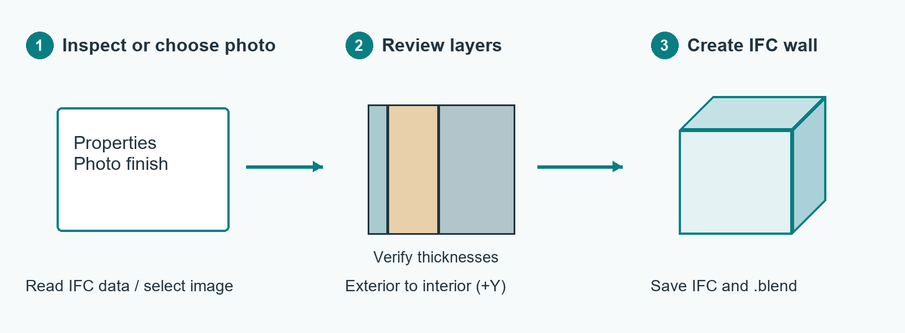

1. Select an IFC element and open **N → Hemy IFC** to inspect attributes, property sets, quantities, materials and type. Search, copy the GlobalId, export JSON, or show and hide an IFC class.
2. For a photo wall, open an **IFC4** project and **Create Wall Type from Photo**. Choose or paste a photo, then enter the wall type and **reviewed exterior-to-interior layers**, thicknesses and materials.
3. Confirm the build-up, click **Create IFC Wall Type and Wall**, inspect the result, then save **both IFC and `.blend`**. The photo material needs the Blender file; the IFC retains the type and material layer data.

The photo only describes the visible finish; it cannot reveal hidden construction layers. **Suggest with AI** is optional and sends the image to the configured OpenAI API when invoked. See the [full photo-wall guide](docs/Hemy_IFC_User_Guide.md).

### Bonsai UX Host 0.2.0 — one entry point for the tools

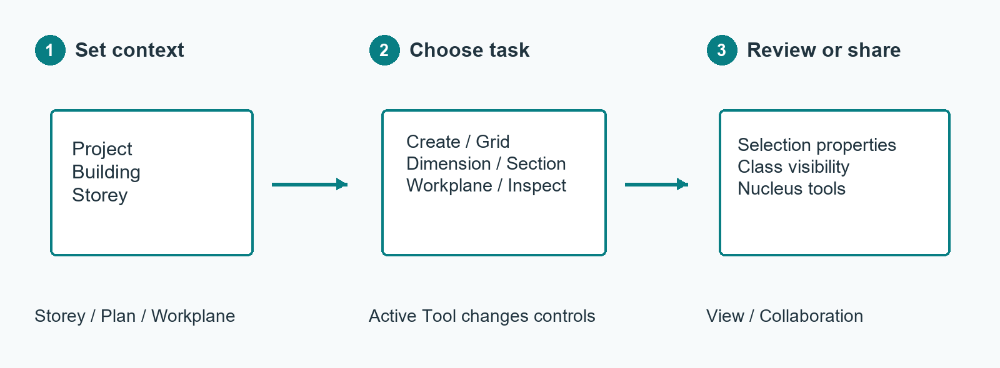

1. Open **N → BIM**. In **Context**, check project, building, storey and workplane, then choose Plan or 3D.
2. In **Active Tool**, choose Create, Grid, Dimension, Workplane, Section or Inspect. **Reference Dimension** opens Dynamic Dimension; **Driving Dimension** opens Plan Dimensions.
3. Use **Selection** for IFC identity and type, **View** for clipping and class visibility, and **Collaboration** for Nucleus files or sync.

The UX Host calls the other enabled add-ons; it does not replace them. If a control is unavailable, check the selected object, view and mode, then verify that its companion add-on is enabled. **BIM Integration Diagnostics** is available in the UX Host preferences.

### Choose the right save or sharing action

| Goal | Action |
| --- | --- |
| Preserve BIM geometry, types and property edits | Save the **IFC** through Bonsai. |
| Preserve Blender scene and custom tool settings | Save the **`.blend`** file. |
| Upload a native project to Nucleus | Use **Nucleus Files → Save** or **Save As** and wait for confirmation. |
| Send scene updates for Omniverse review | Start **Nucleus Live Sync** with its receiver; save the native project separately. |
| Share a visual scene or image | Use Blender's bundled **glTF 2.0 exporter** or **Cycles** render engine. These are not custom packages in this repository. |

Blender's bundled **Pose Library** handles armature pose assets and is generally unrelated to IFC authoring. If a tool seems unavailable, check that an IFC project and the right element are loaded, confirm Object versus Edit Mode, and turn on overlays and gizmos for workplane grids or grid handles.

## BIM workspaces

`scripts/build_bim_ux_startup.py` creates a **model-free** `.blend` with **BIM Model**, **BIM Plan**, and **BIM Review** workspaces under `qa/bim_ux_startup.blend`. Run it against Blender's factory startup file, then inspect that output before choosing whether to use it as a startup file:

```powershell
$blender = 'C:\Program Files\Blender Foundation\Blender 5.2\blender.exe'
& $blender --background --factory-startup --python-exit-code 1 --python scripts/build_bim_ux_startup.py
```

The generated `.blend` is ignored by Git. It does not include your production model, user preferences, installed add-ons, or Nucleus credentials. The handover's existing native workspaces and compacted tab setting were part of that Blender profile, so installing ZIPs alone does not recreate those profile settings.

## Validate changes

Use Blender's Python so `bpy` and IfcOpenShell are available:

```powershell
& $blender --background --factory-startup --python-exit-code 1 --python scripts/test_bonsai_ux_host.py
& $blender --background --factory-startup --python-exit-code 1 --python scripts/check_blender.py
& $blender --background --factory-startup --python-exit-code 1 --python scripts/check_wall_authoring.py
```

The wall tests write disposable files under `qa/`. `scripts/check_bonsai_wall_tool.py` also needs Bonsai enabled in the Blender profile. For real-model validation, run `scripts/check_ifc_model.py` with a locally held IFC file after `--`. Do not commit project IFC files or QA output.

## Publish a version

1. Update the version of each changed add-on and record the Blender, Bonsai, and IfcOpenShell versions used for testing.
2. Build all ZIPs, install changed packages in a disposable Blender profile, and test the affected workflow.
3. Commit and tag the tested source. Attach the 11 ZIPs to a GitHub Release with compatibility and migration notes.

See [the Hemy IFC user guide](docs/Hemy_IFC_User_Guide.md) for the photo-wall workflow. The [BIM UX feature map](docs/BIM_UX_FEATURES.md) records the handover's controls and validation limits.
