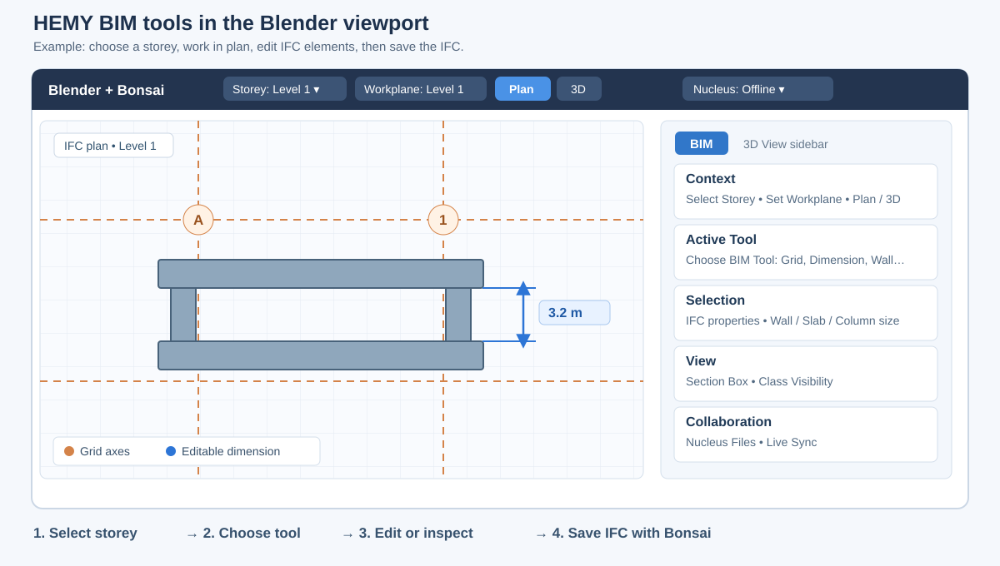

# HEMY Blender BIM add-ons

Source and installable packages for the **11 custom add-ons** in the [BIM UX feature map](docs/BIM_UX_FEATURES.md). The twelfth add-on in that setup, official **Bonsai 0.8.5**, is an external dependency. The documented environment is Blender **5.2.1 LTS**.

## What each add-on does

| Add-on | Version | How you use it |
| --- | --- | --- |
| `hemy_ifc_panel` | 0.4.2 | Inspect an element's IFC properties, filter model visibility by IFC class, or use **BIM → Active Tool → Create Wall from Photo** to build a layered wall type. See the [photo-wall guide](docs/Hemy_IFC_User_Guide.md). |
| `bonsai_ux_host` | 0.2.0 | Open the **BIM** tab in the 3D View sidebar. Choose a task, then use **Context**, **Active Tool**, **Selection**, **View**, or **Collaboration**. It also places storey, workplane, Plan/3D, and Nucleus status controls in the viewport header. |
| `bonsai_storey_toolbar` | 1.2.0 | Choose an IFC storey, switch between locked **Plan** and navigable **3D**, and set a vertical **View Range**. The selected storey becomes Bonsai's default spatial container. |
| `workplane_toolkit` | 1.0.0 | Set a modeling plane from a selected face, the cursor, the current view, or an XY/XZ/YZ world plane. Use its grid and transform orientation while modeling, then restore the previous setup. |
| `bonsai_grid_toolbar` | 1.1.0 | Open **IFC Grid** in the left toolbar or sidebar. Create a row/column grid, draw or offset axes, rename labels, and stretch a straight axis by dragging an endpoint handle. |
| `bonsai_plan_dimensions` | 0.1.1 | In **Plan Dimensions**, select a storey and two parallel walls or grid axes. Add a dimension, then edit its value to move the chosen wall or grid axis in the IFC model. It can also chain selected grid axes. |
| `bonsai_dynamic_dimension` | 0.3.2 | In top plan, pick two parallel IFC wall faces or two IFC points and place an aligned reference dimension. **Edit Value** can move the linked IFC element when you choose to make a driving edit. |
| `bonsai_section_box` | 1.1.0 | Select model elements and choose **BIM → View → Fit Section Box to Selection** to focus on a 3D region. Use **Reset Section Box** to restore the view. |
| `bonsai_slab_thickness` | 1.3.0 | With a typed wall, slab, or column selected, use **BIM → Selection** or the corresponding Bonsai tool to set type-specific wall/slab thickness or rectangular/circular column profile size. Existing occurrences of that type are regenerated. |
| `bonsai_nucleus_files` | 1.0.0 | Open **BIM → Collaboration** or **File → BIM Projects on Nucleus** to browse projects. Use the native browser's distinct **Open**, **Save**, and **Save As** actions for IFC/IFCZIP or Blender files. |
| `bonsai_nucleus_sync` | 0.1.0 | Configure a Nucleus USD stage and receiver token, then start, stop, or resync a live session from **BIM → Collaboration** or the **Bonsai Sync** sidebar. |

### Illustrated interface



*Illustration of the control layout; it is not a screenshot of a project. The BIM tab collects shortcuts while the companion add-ons perform the actions.*

For a typical plan task: **open an IFC in Bonsai → select a storey → choose Plan → create or edit a grid → place a dimension → save the IFC through Bonsai**. A `.blend` save alone does not save IFC edits. For review, select elements and use **View → Fit Section Box to Selection**; use **Collaboration** only after configuring your own Nucleus service.

The source directories hold the custom add-ons captured with the handover. Machine-specific Nucleus server defaults and SDK paths were removed from this repository copy. The two Blender extensions, `bonsai_plan_dimensions` and `workplane_toolkit`, have `blender_manifest.toml` files and their ZIPs use the extension layout. The other nine ZIPs use the legacy add-on folder layout. Keep each add-on's own license files with its source and ZIP.

## Build and install

Install and enable official Bonsai first. Save your work and close other Blender windows, since the installer updates add-on files and Blender preferences. From the repository root, build the packages and run the bulk installer with Blender 5.2:

```powershell
python scripts/package.py
$blender = 'C:\Program Files\Blender Foundation\Blender 5.2\blender.exe'
& $blender --background --python-exit-code 1 --python scripts/install_all.py
```

`scripts/package.py` creates **one ZIP per add-on** in `dist/`. `scripts/install_all.py` validates all 11 ZIPs before changing Blender, installs both extension and legacy formats, enables the companion add-ons before `bonsai_ux_host`, and saves Blender preferences. It updates existing copies of these add-ons. It does not install official Bonsai, open an IFC model, or configure Nucleus access.

GitHub Actions builds and checks the same 11 ZIPs on every push and pull request. If you download the `blender-addons` artifact from a successful run, **extract the artifact ZIP first** and point the installer at the folder containing the 11 individual ZIPs:

```powershell
& $blender --background --python-exit-code 1 --python scripts/install_all.py -- --source 'C:\path\to\extracted\blender-addons'
```

Run `--dry-run` after the final `--` to check the ZIPs and prerequisites without installing. Use `--install-only` to place the packages before Bonsai is enabled; you must then enable Bonsai and these add-ons in Blender Preferences. The `blender-addons` artifact is a build output, not a published GitHub Release. You can still install individual ZIPs through **Edit → Preferences → Get Extensions → Install from Disk**. The UX Host exposes controls from enabled companion add-ons; its buttons do not replace their implementations. Nucleus file access and live sync additionally need your own Nucleus service and connection settings.

The BIM sidebar groups controls under **Context, Active Tool, Selection, View, Collaboration**. Its task switcher offers **Select, Create, Grid, Dimension, Workplane, Section, Inspect**. The viewport header exposes the storey, workplane, plan/3D, and Nucleus status controls. The handover lists the exact UI locations and the actions that were tested.

## BIM workspaces

`scripts/build_bim_ux_startup.py` creates a **model-free** `.blend` with **BIM Model**, **BIM Plan**, and **BIM Review** workspaces under `qa/bim_ux_startup.blend`. Run it against Blender's factory startup file, then inspect that output before choosing whether to use it as a startup file:

```powershell
$blender = 'C:\Program Files\Blender Foundation\Blender 5.2\blender.exe'
& $blender --background --factory-startup --python-exit-code 1 --python scripts/build_bim_ux_startup.py
```

The generated `.blend` is ignored by Git. It does not include your production model, user preferences, installed add-ons, or Nucleus credentials. The handover's existing native workspaces and compacted tab setting were part of that Blender profile, so installing ZIPs alone does not recreate those profile settings.

## Validate changes

Use Blender's Python so `bpy` and IfcOpenShell are available:

```powershell
& $blender --background --factory-startup --python-exit-code 1 --python scripts/test_bonsai_ux_host.py
& $blender --background --factory-startup --python-exit-code 1 --python scripts/check_blender.py
& $blender --background --factory-startup --python-exit-code 1 --python scripts/check_wall_authoring.py
```

The wall tests write disposable files under `qa/`. `scripts/check_bonsai_wall_tool.py` also needs Bonsai enabled in the Blender profile. For real-model validation, run `scripts/check_ifc_model.py` with a locally held IFC file after `--`. Do not commit project IFC files or QA output.

## Publish a version

1. Update the version of each changed add-on and record the Blender, Bonsai, and IfcOpenShell versions used for testing.
2. Build all ZIPs, install changed packages in a disposable Blender profile, and test the affected workflow.
3. Commit and tag the tested source. Attach the 11 ZIPs to a GitHub Release with compatibility and migration notes.

See [the Hemy IFC user guide](docs/Hemy_IFC_User_Guide.md) for the photo-wall workflow. The [BIM UX feature map](docs/BIM_UX_FEATURES.md) records the handover's controls and validation limits.
