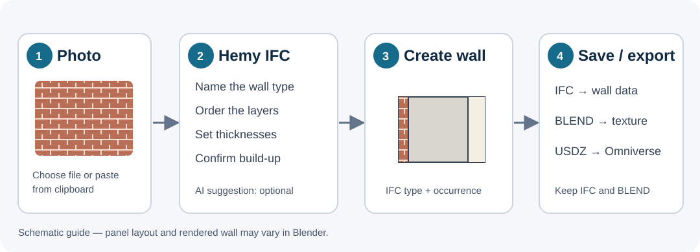
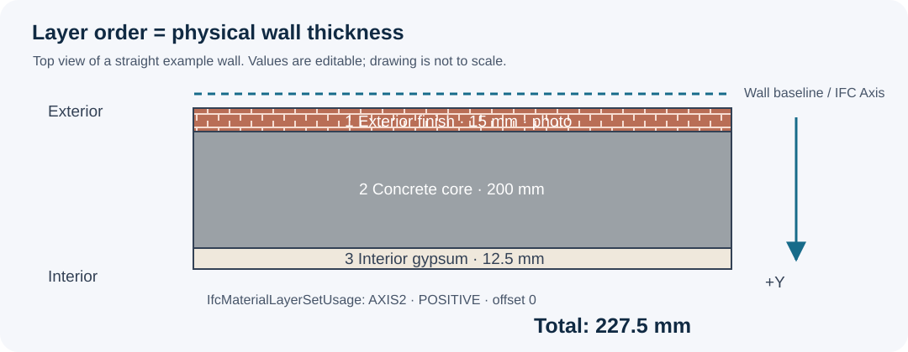

# Hemy IFC add-on: user guide

Use the **Hemy IFC** sidebar in Blender to inspect a Bonsai IFC model, create a layered `IfcWallType` from a wall photo, and export a textured wall for Omniverse.

## Before you start

1. Start Blender with **Bonsai** and **Hemy 360 — IFC Element Properties** enabled. The installed add-on is v0.4.2.
2. In Bonsai, open an **IFC4** project. The wall builder checks for an active project and requires IFC4.
3. In a **3D View**, press **N**, then choose the **Hemy IFC** tab on the right. Expand **Create Wall Type from Photo**.
4. Prepare a PNG, JPG/JPEG, or WebP image of the visible wall finish. A straight-on, evenly lit photo gives a cleaner preview. The photo describes only the visible finish; you must supply the construction layers.

If installing on another Blender profile, go to **Edit → Preferences → Add-ons → Install from Disk**, select [`dist/hemy_ifc_panel.zip`](../dist/hemy_ifc_panel.zip), enable the add-on, and restart Blender. Blender 4.2+ is targeted; the workflow was tested in Blender 5.2.1.

## Create a wall from a photo

1. Click **Choose Photo**, or copy an image to the Windows clipboard and click **Paste**. Confirm that the **Image** path is filled in.
2. Enter a unique **Wall type** name, for example `WT-01 Brick / Concrete / Gypsum`.
3. Click **Three-layer example** to add editable **Exterior finish**, **Core**, and **Interior finish** rows, or click **Add layer** to build the stack yourself.
4. Work from **exterior to interior**. For each row, set **Layer role**, **Material name**, **Thickness**, **Ventilated cavity**, and **Viewport color**. Use the up/down arrows to change order and **X** to remove a row. The photo texture is applied to **layer 1**; the other Blender materials use their chosen viewport colors.
5. Set **Preview length** and **Preview height**. Check **I have checked the wall build-up** after reviewing the actual material names and thicknesses.
6. Click **Create IFC Wall Type and Wall**. The wall becomes the selected object in the 3D View. Bonsai holds the `IfcWallType`, its ordered material layers, and an `IfcWall` occurrence.
7. Save the **IFC project in Bonsai**, then save the **`.blend` file**. IFC stores the wall construction and geometry. The `.blend` file keeps the packed photo material for Blender editing.

The **Three-layer example** starts at 15 mm exterior finish + 200 mm core + 12.5 mm interior finish = **227.5 mm** total. Replace these example values with the real specification.

The first layer starts at the wall baseline and subsequent layers run toward local **+Y**. Their thicknesses add up to the physical Blender mesh thickness. The `IfcMaterialLayerSetUsage` on the wall records **AXIS2**, **POSITIVE**, and an offset of **0**.

## See the photo material in Blender

After creation, the add-on sets each 3D View to **Solid shading → Color Type: Texture**. This displays the image on the first layer without relying on Material Preview.

If the wall looks plain or Blender switches back to Solid, select the generated **Wall - …** object and click **Show Photo Texture** in the same Hemy IFC panel. Rotate the view to see the exterior face; the wall ends and top show the layer colors. Ensure you selected the generated wall rather than another IFC object.

### Draw more walls with the same type

In Bonsai's **Wall** tool, select the new `IfcWallType` and draw another wall. The add-on applies the photo and layer colors to new walls of that type in the current Blender session. If the finish has not appeared yet, select the newly drawn wall and click **Apply Finish to Walls of This Type** in Hemy IFC. This also updates other walls of the same type. Click **Show Photo Texture** if viewport shading is hiding the image.

The IFC layer set and its surface colors belong to the type. The photo shader is a Blender material stored in the `.blend` file, so reopen the saved `.blend` alongside the IFC when you want the image on later walls. An IFC file opened by itself may show the layer colors but cannot recover the packed Blender photo.

## Optional AI suggestion

Click **Suggest with AI** after choosing a photo to propose a wall type name and the **first layer's visible material name**. Review and edit its proposal. The AI does not determine hidden layers, thicknesses, fire rating, or performance.

To enable this button, make `OPENAI_API_KEY` available in Blender's process environment and restart Blender. The image is sent to the OpenAI API. The request may pause Blender briefly. This step is optional; the wall builder works without AI.

## Export the textured wall to Omniverse

1. Select the generated wall in Blender.
2. Click **Export Preview to Omniverse USDZ** in the Hemy IFC panel.
3. Choose a `.usdz` destination, then open that file in Omniverse.

The USDZ packages the texture and visual wall. Keep the IFC file alongside it for BIM type, layer, and occurrence information. Opening the IFC alone does not carry the Blender photo texture through the normal Bonsai save workflow.

## Other Hemy IFC panels

- **Hemy 360 | Element Properties:** select an IFC object to inspect its class, attributes, property sets, quantities, materials, classification, and spatial location. Search the rows, copy its GlobalId, or use **Export JSON**.
- **IFC Class Visibility:** search for an IFC class and click **Hide** or **Show** to change visibility of its objects in the active view layer.

## Earlier photo previews and common problems

| What you see | What to do |
| --- | --- |
| A photo preview from add-on v0.3.0 has no IFC wall link | Open its original IFC project, select the preview, and click **Link Older Preview to IFC Wall**. Save IFC and `.blend`. |
| **Create** says there is no IFC project | Enable Bonsai and open an IFC4 project first. |
| **Create** says the type already exists | Enter a different wall type name. |
| The wall has no photo in the viewport | Select the generated wall and click **Show Photo Texture**. Save and reopen the `.blend` when you need the photo later. |
| A wall drawn later with Bonsai's Wall tool has only a plain color | Select that wall and click **Apply Finish to Walls of This Type**, then **Show Photo Texture**. Save the `.blend` to retain the photo material. |
| Adding a door makes the wall finish disappear | Bonsai rebuilds the wall mesh to cut the opening. Version 0.4.2 reapplies the photo and UVs after the rebuild. For an already affected wall, select it and click **Apply Finish to Walls of This Type**, then **Show Photo Texture**. |
| **Suggest with AI** says the key is missing | Set `OPENAI_API_KEY` in Blender's environment, restart Blender, or skip AI. |
| USDZ looks wrong in Omniverse | Check that the generated wall was selected, then export it again. Keep the IFC for construction data. |
